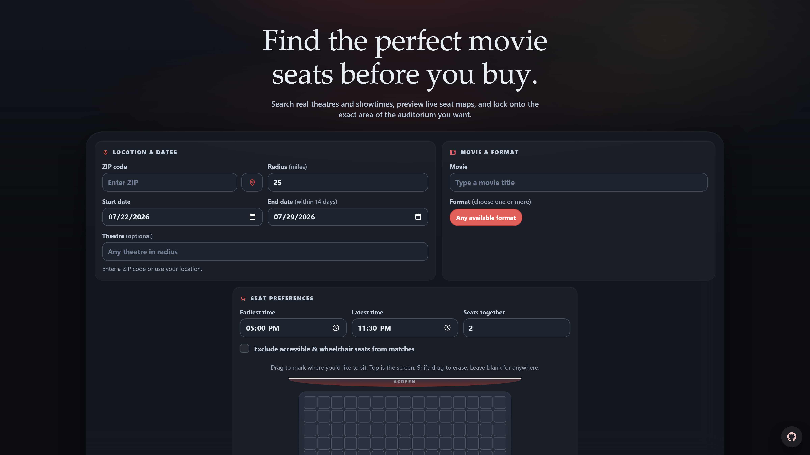

<p align="center">
  
</p>

<h1 align="center">Movie Seat Finder</h1>

<p align="center">
  <em>Find the perfect movie seats before you buy.</em>
</p>

<p align="center">
  <a href="https://github.com/ivan-grebe/movieseatfinder/actions/workflows/tests.yml"></a>
  <a href="LICENSE"></a>
</p>

Movie Seat Finder searches live Fandango showtimes and seat maps, then finds adjacent available seats in the part of the auditorium you choose.

## Features

- Search by ZIP code or your precise browser location.
- Filter by theatre, movie, multiple formats, dates, and times.
- Find adjacent seats in a custom auditorium region.
- Preview normalized seat maps and exclude accessible seats when needed.
- Use guarded API routes with validation, rate limiting, and safe ticket URLs.

## Run locally

Requirements: Python 3.12+ and Node.js 22+.

```bash
git clone https://github.com/ivan-grebe/movieseatfinder.git
cd movieseatfinder
pip install -e ".[test]"
npm ci
uvicorn app:app --reload --host 127.0.0.1 --port 4173
```

Open [http://127.0.0.1:4173/](http://127.0.0.1:4173/) to use the app.

## Testing

```bash
python -m unittest discover -s tests -v
npm run test:frontend
npm run test:mobile
```

GitHub Actions runs these checks on every pull request, each push to `main`, and daily at 09:17 UTC.

## Support the project

If Movie Seat Finder is useful, consider giving the repository a ⭐. It helps others discover it and supports continued improvements.

## License

Released under the [MIT License](LICENSE).
