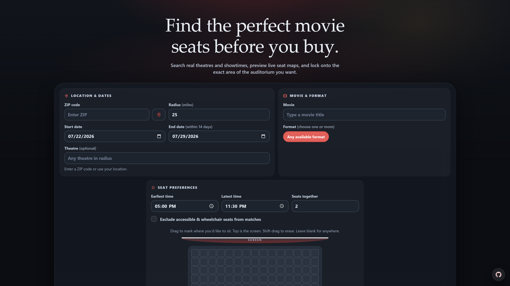

<p align="center">
  
</p>

<h1 align="center">Movie Seat Finder</h1>

<p align="center">
  <em>Find the perfect movie seats before you buy.</em>
</p>

<p align="center">
  <a href="https://github.com/ivan-grebe/movieseatfinder/actions/workflows/tests.yml"></a>
  <a href="LICENSE"></a>
</p>

Movie Seat Finder searches live Fandango showtimes and seat maps, then finds adjacent available seats in the part of the auditorium you choose.

## Features

- Search by ZIP code or your precise browser location.
- Filter by theatre, movie, multiple formats, dates, and times.
- Find adjacent seats in a custom auditorium region.
- Preview normalized seat maps and exclude accessible seats when needed.
- Use guarded API routes with validation, rate limiting, and safe ticket URLs.
- Connect messaging assistants through an authenticated MCP movie-seat search tool.

## Run locally

Requirements: Python 3.12+ and Node.js 22+.

```bash
git clone https://github.com/ivan-grebe/movieseatfinder.git
cd movieseatfinder
pip install -e ".[test]"
npm ci
npm run build:frontend
uvicorn app:app --reload --host 127.0.0.1 --port 4173
```

Open [http://127.0.0.1:4173/](http://127.0.0.1:4173/) to use the app.

## Poke / MCP integration

The production ASGI entry point exposes a stateless Streamable HTTP MCP server at `/mcp`. It provides a discovery-first flow with three tools:

1. `get_location_and_movie_info` accepts a ZIP code, date range, radius, and optional theatre filter. It returns the exact live theatre names, canonical movie titles (including release years), available dates, and format strings for that search.
2. `find_movie_seats` accepts one exact discovered movie title, an inclusive date range, explicitly accepted discovered formats, party size, time window, user-supplied radius, and an exact `seat_cells` selection.
3. `show_movie_seat_map` accepts one opaque, signed, five-minute selection token and refreshes only that selected showtime.

Poke is instructed to discover first and pass those strings back verbatim, so `The Odyssey` is never silently treated as `The Odyssey (2026)`. If both are plausible live results, it should ask the user which one they mean. The seat tool describes a 15x15, 1-based `row:column` grid: row 1 is nearest the screen, row 15 is the back, column 1 is the left edge, and column 15 is the right edge. Poke can select any combination of cells, including irregular shapes; an empty list means anywhere in the auditorium.

The MCP initialization payload also carries a complete conversational operating contract. The agent retains details supplied early, asks one focused missing-detail question per turn, and discovers live formats before asking the user to choose one. Before discovery it must know the movie, date or date range, ZIP code, radius, party size, and seat preference. If time is omitted it explicitly announces and uses 2:00 PM through midnight; searches are nearest-first, accessible seats are silently excluded unless requested, and ordinary "good seats" means broadly centered and about two-thirds back.

Search results are presented as no more than five compact, nearest-first lines, followed by one question offering a seat map or ticket link. Each option contains a `seatMapRequest` with only a `selection_token`, removing the need for an agent to reconstruct the search. During the token's five-minute lifetime the map tool refreshes only that showtime; after expiration it automatically repeats the exact saved search. The 1800x1200 dark PNG mirrors the website's real Fandango auditorium background and seat styling: all matching seats use the red accent, available seats are white, unavailable seats are gray, and accessible seats are blue.

For a public Poke Recipe, configure the integration template without authentication:

```text
URL: https://movieseatfinder.com/mcp
Authentication: None
```

The endpoint applies global and per-IP throttling to every request, plus per-user throttling whenever Poke supplies its `X-Poke-User-Id` header. Connection-test probes without a user header remain supported. A correctly configured optional `MCP_API_KEY` bearer token remains accepted for backwards compatibility with private test integrations, but public Recipe users do not need a key. Set `MCP_SELECTION_SECRET` to a stable random deployment secret so selection tokens remain valid across instances and deployments. `MCP_ALLOWED_HOSTS` and `MCP_ALLOWED_ORIGINS` can optionally override the comma-separated production allowlists.

## Testing

```bash
python -m unittest discover -s tests -v
npm run check:frontend-bundle
npm run test:frontend
npm run test:mobile
```

GitHub Actions runs these checks on every pull request, each push to `main`, and daily at 09:17 UTC.

## Support the project

If Movie Seat Finder is useful, consider giving the repository a ⭐. It helps others discover it and supports continued improvements.

## License

Released under the [MIT License](LICENSE).
