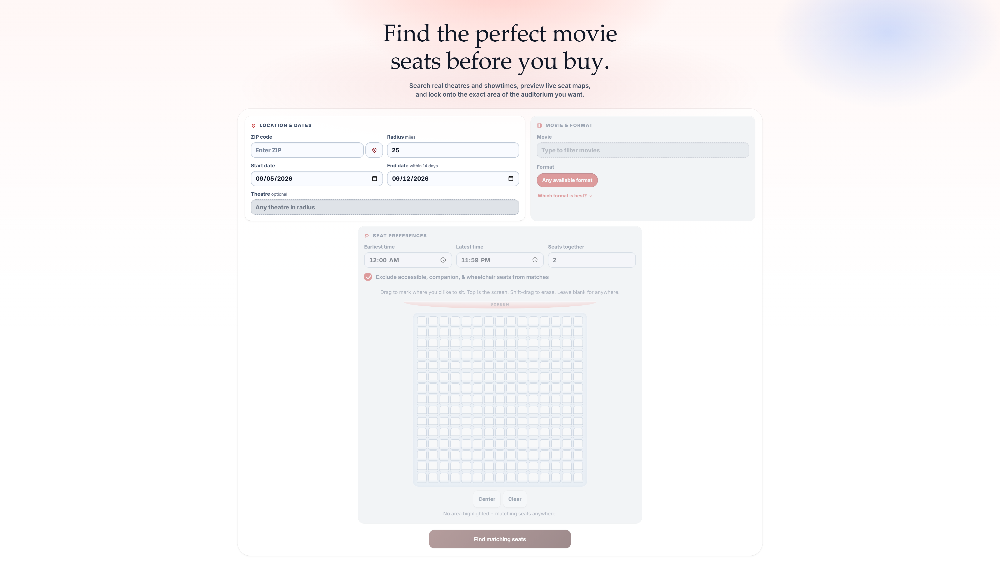

<p align="center">
  
</p>

<h1 align="center">Movie Seat Finder</h1>

<p align="center">
  <em>Find the perfect movie seats before you buy.</em>
</p>

<p align="center">
  <a href="https://github.com/ivan-grebe/movieseatfinder/actions/workflows/tests.yml"></a>
  <a href="LICENSE"></a>
</p>

Movie Seat Finder searches live Fandango showtimes and seat maps, then finds adjacent available seats in the part of the auditorium you choose.

## Features

- Search by ZIP code or your precise browser location.
- Filter by theatre, movie, multiple formats, dates, and times.
- Find adjacent seats in a custom auditorium region.
- Preview normalized seat maps and exclude accessible seats when needed.
- Use guarded API routes with validation, rate limiting, and safe ticket URLs.
- Connect messaging assistants through an authenticated MCP movie-seat search tool.

## Run locally

Requirements: Python 3.12+ and Node.js 22+.

```bash
git clone https://github.com/ivan-grebe/movieseatfinder.git
cd movieseatfinder
pip install -e ".[test,dev]"
npm ci
npm run build:frontend
uvicorn backend.server:app --reload --host 127.0.0.1 --port 4173
```

Open [http://127.0.0.1:4173/](http://127.0.0.1:4173/) to use the app.

## Project layout

```text
src/backend/             Python website and MCP server
src/frontend/scripts/    Browser JavaScript modules
src/frontend/styles/     Authored stylesheets
src/frontend/templates/  Server-rendered HTML templates
src/frontend/dist/       Generated production bundles
branding/                Repository and website brand assets
tests/                   Python, frontend, and browser tests
```

## MCP integration

The production app exposes a stateless Streamable HTTP MCP server at `/mcp`. It uses a discovery-first flow:

- `get_location_and_movie_info` finds live theatres, titles, dates, and formats.
- `find_movie_seats` searches a discovered title and normalized format using a compact rectangular seat region or an advanced arbitrary shape.
- `show_movie_seat_map` refreshes a selected showtime and returns a dark image using the website seat-map layout, plus structured seat groups.

Agents can pass movie and format hints during discovery, proceed on an unambiguous normalized match, and offer compact nearest-first results with ranked seat groups, a seat map, or a ticket link.

For any MCP client, use:

```text
URL: https://movieseatfinder.com/mcp
Authentication: None
```

The MCP endpoint is public and requires no authentication. Requests are accepted on the production and local-development hosts; browser-originated requests are accepted only from localhost.

## Testing

```bash
python -m unittest discover -s tests -v
python -m ruff check .
python -m ruff format --check .
npm run format:check
npm run lint
npm run lint:frontend
npm run check:frontend-bundle
npm run test:frontend
npm run test:mobile
```

To apply automatic fixes and formatting before opening a pull request:

```bash
python -m ruff check --fix .
python -m ruff format .
npm run format
```

GitHub Actions runs these checks on every pull request, each push to `main`, and daily at 09:17 UTC.

## Support the project

If Movie Seat Finder is useful, consider giving the repository a ⭐. It helps others discover it and supports continued improvements.

## License

Released under the [MIT License](LICENSE).
